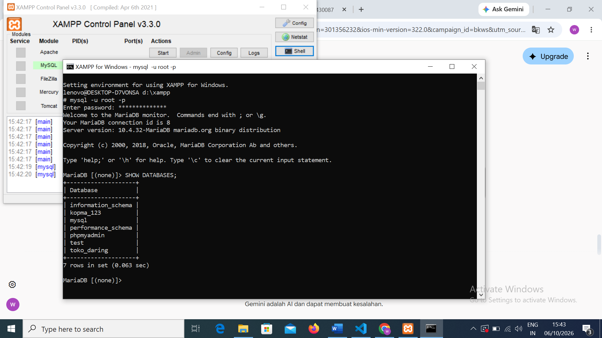

# Laporan Praktikum Basis Data – Pertemuan 01
**Nama:** Wulan 
**NIM:** 087 
**Kelas:** D 
**Tanggal:** 06 Oktober 2026 ...


## 1. Tujuan Praktikum
* Mahasiswa mampu membuat database baru menggunakan perintah SQL.
* Mahasiswa mampu membuat user baru dan memberikan hak akses (privileges) pada database MySQL/MariaDB.

## 2. Ringkasan Dasar Teori
Manajemen pengguna dan hak akses merupakan aspek penting dalam keamanan basis data relasional. Di MySQL, perintah `CREATE DATABASE` digunakan untuk membuat database baru, `CREATE USER` untuk mendaftarkan pengguna baru, dan `GRANT` untuk memberikan izin spesifik kepada pengguna tersebut terhadap database tertentu agar sistem tetap aman dan terstruktur.

## 3. Hasil Langkah Percobaan
* Perintah SQL yang dijalankan untuk membuat database dan user:
  ```sql
  CREATE DATABASE kopma_123 CHARACTER SET utf8mb4 COLLATE utf8mb4_unicode_ci;
  CREATE USER 'wulan_087'@'localhost' IDENTIFIED BY '<password_kerja>';
  GRANT ALL PRIVILEGES ON kopma_123.* TO 'wulan_087'@'localhost';

## 4. Jawaban Titik Analisis
1. **Mengapa menggunakan `utf8mb4`?** 
   Karena `utf8mb4` mendukung penuh rangkaian karakter yang lebih luas, termasuk emoji dan karakter multibahasa, dibandingkan set karakter standar `utf8`.
2. **Apa fungsi dari `@'localhost'`?** 
   Batasan tersebut memastikan bahwa user `wulan_087` hanya dapat melakukan koneksi ke database dari mesin/server lokal yang sama demi alasan keamanan.

## 5. Hasil Latihan dan Modifikasi
* Melakukan verifikasi hak akses dengan perintah:
  ```sql
  SHOW GRANTS FOR 'wulan_087'@'localhost';
  ## 6. Tugas Mandiri: Milestone Proyek 01
* Perancangan awal struktur tabel dan skema basis data untuk proyek sistem informasi koperasi (`kopma_123`).

## 7. Pembahasan dan Kendala
* **Pembahasan:** Praktikum pembuatan database dan pengaturan user ini berjalan lancar. Seluruh sintaks SQL berhasil dieksekusi dengan hak akses penuh (root).
* **Kendala:** Tidak ada kendala teknis yang signifikan yang ditemukan selama proses percobaan.

## 8. Kesimpulan
Pembuatan database `kopma_123` serta konfigurasi user `wulan_087` dengan hak akses penuh telah berhasil dilakukan sesuai dengan skenario praktikum basis data.

## 9. Pernyataan Penggunaan AI
Saya menyatakan bahwa penggunaan AI pada laporan ini digunakan sebagai panduan format, pengecekan sintaks SQL, serta penyusunan struktur teks laporan.

## 10. Bukti Git
* [Tautan Repositori GitHub](https://github.com/wulann10/basisdata-25430087/blob/main/laporan/p01_laporan_087.md)

## Checklist
- [x] Kerangka laporan sesuai dengan format buku panduan
- [x] Perintah SQL telah diuji coba
- [x] Dokumentasi dan poin analisis telah lengkap